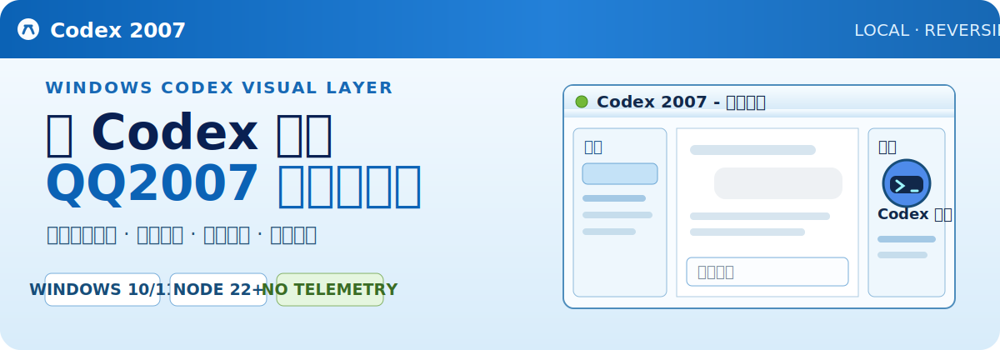
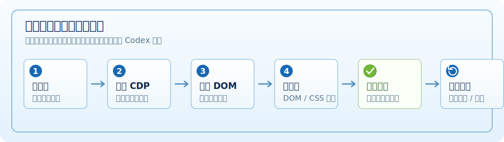

<p align="center">
  
</p>

<p align="center"><strong>保留 Codex 原生交互，把熟悉的蓝色窗口、好友面板和状态栏带回来。</strong></p>

<p align="center">Windows 10/11 · Node.js 22+ · 本机注入 · 可验证恢复</p>

> [!IMPORTANT]
> Codex 2007 是非官方视觉项目，与腾讯、QQ、OpenAI 均无隶属、授权或背书关系。`QQ`、`Codex` 及相关标识属于各自权利人；代码采用 MIT 许可证，第三方图标不在 MIT 授权范围内。

## 先看效果

<p align="center">
  
  &nbsp;&nbsp;
  
</p>

<p align="center"><sub>Codex 小蓝敲键盘 · QQ Retro 挥手并眨眼</sub></p>

Codex 2007 是面向 Windows Codex 桌面应用的 QQ2007 怀旧视觉层。它不替换官方应用，而是在你主动从主题快捷方式启动时，把原生界面映射为经典蓝色标题栏、工具栏、任务列表、好友形象栏和底部状态栏。

| 你会得到 | 项目如何保证 |
| --- | --- |
| 三栏 QQ2007 工作区 | 左侧任务、中央原生对话、右侧好友形象栏协同布局 |
| 原生操作不被替代 | 个人资料、模型、附件、发送、设置开关与下拉仍由 Codex 控件处理 |
| 有依据的状态呈现 | “Q币余额”来自剩余用量百分比；QQ 等级来自本地累计 Token 数值 |
| 可验证、可撤销 | 注入后独立检查原生控件；恢复脚本移除视觉层并关闭调试端口 |

## 它与普通皮肤的区别

- **不修改官方包**：不改 `WindowsApps`、`app.asar`、应用签名、聊天数据库或 `.codex/config.toml`。
- **不伪造核心交互**：可见 QQ 控件负责呈现，关键点击最终仍命中 Codex 原生按钮。
- **不读取聊天正文**：Token 统计只提取本机会话中的累计数值，不保存或上传正文。
- **不掩盖失败**：原生 DOM 或关键控件不匹配时，启动器返回非零退出码，而不是报告伪成功。

## 工作原理

<p align="center">
  
</p>

主题通过只监听 `127.0.0.1` 的 Chromium DevTools Protocol（CDP）等待 Codex 原生 DOM，再注入本地 DOM/CSS 视觉层。安装器、注入器与验证器相互独立：只有视觉层存在、原生应用完整且关键控件仍可用时，验收才会通过。

更完整的组件关系和选择器策略见 [架构文档](docs/ARCHITECTURE.md)。

## 3 分钟安装

准备好 Windows 10/11、官方 Windows Codex 桌面应用和 Node.js 22+，然后在 PowerShell 中运行：

```powershell
git clone https://github.com/LeemanCheung/Codex-QQ2007-Skin.git
cd Codex-QQ2007-Skin
powershell.exe -NoProfile -ExecutionPolicy Bypass -File .\windows\Install-Codex-2007.ps1
```

安装完成后，从桌面或开始菜单打开 **Codex 2007**。直接启动官方 Codex 不会应用皮肤。

只安装、不立即重启：

```powershell
powershell.exe -NoProfile -ExecutionPolicy Bypass -File .\windows\Install-Codex-2007.ps1 -NoLaunch
```

恢复官方外观：

```powershell
powershell.exe -NoProfile -ExecutionPolicy Bypass -File .\windows\Restore-Codex.ps1
```

`-ExecutionPolicy Bypass` 仅作用于这一次 PowerShell 进程，不会修改系统执行策略。完整步骤见 [安装文档](docs/INSTALLATION.md)。

## 兼容性与安全边界

当前已在 Codex `26.715.4045.0` 和 `26.715.7063.0` 实机验证。Codex DOM 不是公开稳定 API，应用升级后选择器仍可能变化；版本跨度和已知限制见 [兼容性说明](docs/COMPATIBILITY.md)。

CDP 能控制渲染器，因此它是明确的本机攻击面。项目将地址限制为 `127.0.0.1`，并校验监听进程、官方程序路径、页面地址和 WebSocket 路径；使用结束后可运行恢复脚本关闭端口。完整威胁边界见 [SECURITY.md](SECURITY.md) 与 [隐私说明](docs/PRIVACY.md)。

运行态 `verify.json` 和截图可能包含任务名称、用量等个人信息，因此不会提交到仓库。复现验证请按 [验证手册](docs/VERIFICATION.md) 在自己的环境生成证据。

## 文档导航

- **开始使用**：[安装](docs/INSTALLATION.md) · [使用](docs/USAGE.md) · [故障排查](docs/TROUBLESHOOTING.md)
- **理解实现**：[架构](docs/ARCHITECTURE.md) · [兼容性](docs/COMPATIBILITY.md) · [验证](docs/VERIFICATION.md)
- **边界与来源**：[隐私](docs/PRIVACY.md) · [素材来源](docs/SOURCES.md) · [安全报告](SECURITY.md)
- **参与项目**：[贡献指南](CONTRIBUTING.md) · [更新记录](CHANGELOG.md) · [支持](SUPPORT.md)

## 来源、许可与独立实现

视觉方向参考 [Randy Lu 发布的概念图](https://x.com/randyloop/status/2077813650564452850)。本仓库不打包第三方换肤引擎或修改后的 Codex 二进制；完整来源、用途和访问日期见 [docs/SOURCES.md](docs/SOURCES.md)。

项目代码及明确标注为项目原创的素材采用 [MIT License](LICENSE.txt)。经典 QQ 等级图标和产品名称不随 MIT 授权，详见 [THIRD_PARTY_NOTICES.md](THIRD_PARTY_NOTICES.md)。
