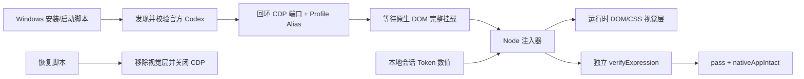

# 架构

## 目标

在不修改官方 Codex 二进制、安装目录、签名、聊天数据库和 TOML 配置的前提下，为单次 Windows Codex 会话添加可恢复、可验证的本地视觉层。

## 组件

### `windows/`

- `Install-Codex-2007.ps1`：复制白名单文件、创建快捷方式并可选择启动。
- `Start-Codex-2007.ps1`：验证官方包、启动回环 CDP、等待 DOM、拉起 watcher 并执行验收。
- `Restore-Codex.ps1`：安全停止主题相关进程、清理已校验 Junction、恢复官方启动。
- `Common.ps1`：路径包含关系、进程身份、端口、包发现、状态读写等公共安全逻辑。

### `src/`

- `injector.mjs`：实现 CDP 客户端、资产内嵌、apply/remove/verify/inspect/screenshot/watch 命令。
- `skin-runtime.js`：识别当前 Codex DOM、标记原生控件、创建视觉节点、同步任务/状态/用量。
- `skin.css`：以主题 class 和运行时 `data-qq2007-*` 标记限定样式范围。
- `token-stats.mjs`：受限读取 JSONL 尾部并返回累计数值。

## 原生交互保留

运行时先发现原生个人资料、模型和发送按钮，再为其添加透明命中区或代理动作。验证器使用 `elementFromPoint` 确认可见发送区域实际命中原生按钮。找不到原生控件时验收失败，不使用自制业务替代。

输入区底栏直接装饰 Codex 原生“添加内容”和访问权限按钮；模型按钮仍由透明原生菜单命中区承接点击。运行时从原生 `aria-label` 读取上下文用量并移动原生指示图标到模型按钮左侧，同时显示同源百分比；不依据 Token 统计自行估算上下文占用。

滚动区域使用统一的 WebKit 滚动条视觉层：17px XP Luna 尺寸、浅蓝凹面轨道、立体蓝色滑块和四向箭头按钮。它只改变 Chromium 原生滚动条的绘制，不创建替代滚动容器，也不接管滚轮、键盘、拖拽或辅助功能行为。

最小化、最大化和关闭按钮属于 Electron/Windows 的非网页客户区，不在页面 DOM 内。主题保留系统原生图标、命中区、悬停与无障碍行为，并优先使用 Codex 提供的 `--spacing-token-safe-header-right` 动态安全区避让；宿主未暴露该值时回退为 137px。渲染器视觉层不能替换系统窗控符号，因此不得在该区域叠放 XP 按钮图片或仿制底板；那会产生重复图标并让视觉位置与真实点击区分离。

## 设置页原生视觉层

设置页通过“搜索设置”输入和“返回应用”语义链接双重识别。命中后运行时只撤出聊天页的合成标题栏、工具栏、好友栏、输入框和状态栏，并把 `data-qq2007-settings-*` 标记附着到真实的应用顶栏、设置侧栏、搜索框、服务行、内容区、标题和表单卡片。

该方式不创建替代设置菜单：`data-settings-panel-slug` 服务行及其 SVG/图片、原生开关和下拉菜单始终保留。验证器要求设置页主题 class、18 类当前服务行标记、QQ2007 设置窗框节点及原生图标同时存在。返回应用后由 DOM observer 清除设置标记并重新协调聊天页布局。

## 选择器策略

优先使用 `aside.app-shell-left-panel`、`main.main-surface`、`.composer-surface-chrome` 和语义属性，再寻找它们的共同 shell/workspace。运行时为 shell、workspace、topbar 添加自身标记，使 CSS 不依赖 `#root` 的固定子节点序号。该设计仍受 Codex DOM 变化影响，详见 [COMPATIBILITY.md](COMPATIBILITY.md)。

中央任务标题框不使用固定左右边距：运行时直接读取中央会话窗口 `main.main-surface` 的外框矩形，并把其视口坐标同步给固定标题宿主；窗口缩放或原生输出侧栏改变布局后会重新计算。标题高度保持为宿主会话头部预留的 46px，使其底边与 `.thread-scroll-container` 顶边重合，避免出现双线或空白带。
