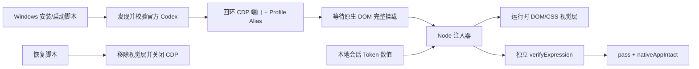

# 架构

## 目标

在不修改官方 Codex 二进制、安装目录、签名、聊天数据库和 TOML 配置的前提下，为单次 Windows Codex 会话添加可恢复、可验证的本地视觉层。

## 组件

### `windows/`

- `Install-QQ2009-Programmer-Codex.ps1`：复制白名单文件、创建快捷方式并可选择启动。
- `Start-QQ2009-Programmer-Codex.ps1`：验证官方包、启动回环 CDP、等待 DOM、拉起 watcher 并执行验收。
- `Restore-Codex.ps1`：安全停止主题相关进程、清理已校验 Junction、恢复官方启动。
- `Common.ps1`：路径包含关系、进程身份、端口、包发现、状态读写等公共安全逻辑。

### `src/`

- `injector.mjs`：实现 CDP 客户端、资产内嵌、apply/remove/verify/inspect/screenshot/watch 命令。
- `skin-runtime.js`：识别当前 Codex DOM、标记原生控件、创建视觉节点、同步任务/状态/用量。
- `skin.css`：以主题 class 和运行时 `data-qq2007-*` 标记限定样式范围。
- `token-stats.mjs`：受限读取 JSONL 尾部并返回累计数值。

## 原生交互保留

运行时先发现原生个人资料、模型和发送按钮，再为其添加透明命中区或代理动作。验证器使用 `elementFromPoint` 确认可见发送区域实际命中原生按钮。找不到原生控件时验收失败，不使用自制业务替代。

## 设置页隔离

设置页通过“搜索设置”输入和“返回应用”语义链接双重识别。命中后会移除合成节点、主题 class、导航图标和运行时标记；验证器检查当前 `data-settings-panel-slug` 行都具有 SVG/图片。返回应用后通过 DOM observer 重新协调布局。

## 选择器策略

优先使用 `aside.app-shell-left-panel`、`main.main-surface`、`.composer-surface-chrome` 和语义属性，再寻找它们的共同 shell/workspace。运行时为 shell、workspace、topbar 添加自身标记，使 CSS 不依赖 `#root` 的固定子节点序号。该设计仍受 Codex DOM 变化影响，详见 [COMPATIBILITY.md](COMPATIBILITY.md)。
